**Brenton Larsen - https://hiphop-operation.github.io/Des222ProcessJournal/**
# Process journal
# Week one
**23/8/24**

Week one is the beginning of my brainstorming sessions as well as starting to learn how to use the micro-bit to its fullest potential.

immediately i am thinking of creating a website or app that responds to the weather and alerts the user of certain conditions. I want to do this because i think its something everyone can benefit from and is easily accessibly through mobile phones and computers.

Another idea could be to use the acceloromator in the micro-bit to sense the movement on the back of a basketball hoop backboard to alert the user of activity in the area. this could be like a signal to say that people are playing nearby. I could also encorporate the microphone on the micro-bit to listen in and use the speaker to play an alert tone.  

I started by working through the modules for knowledge and inspiration.
 

**Meat Queen:**
i found the MeatQueen project to be particularly interesting especially the interaction itself. the connection between user and artwork creates an exciting and immersive experience and is something im very interested in exploring. 

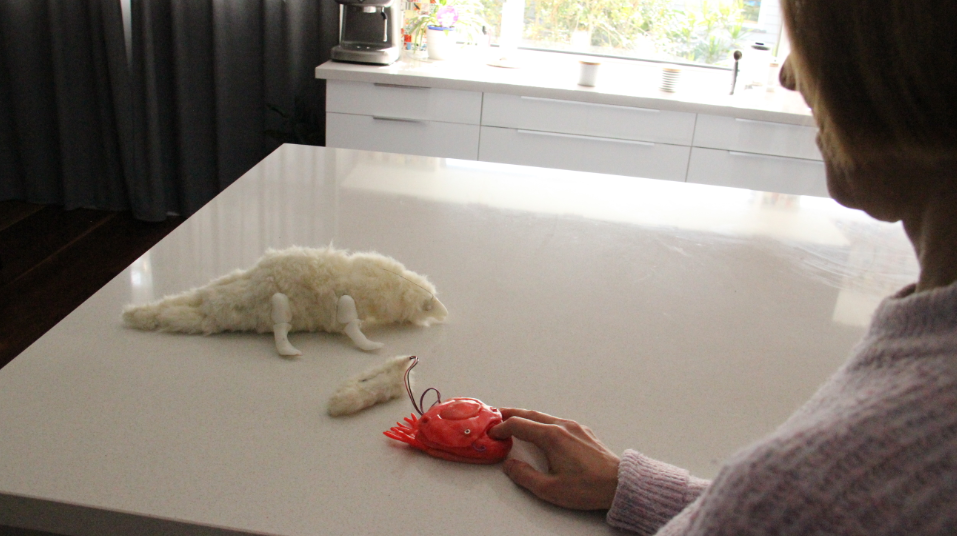

**Responsive Roulette:**
Playing around with the Responsive roulette page found in the modules was a creative way to get me thinking about the possibilites with this project. As well as thinking about the indivuidal components that will come together in my project.
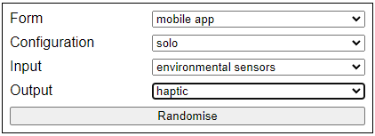 

**Micro-Bit MakeCode:**
By experimenting with the micro-bit by following some of the introductory tutorials found on the micro-bit makecode editor. I was able to creating an acceloromator that would light up the LEDs if it was tilted to the right.

I see alot of potential with this design already. Such as a simple pedometor that can be attached to the ankle and counts each shake it feels. or to be placed inside a basketball to also count the amount of bounces. 
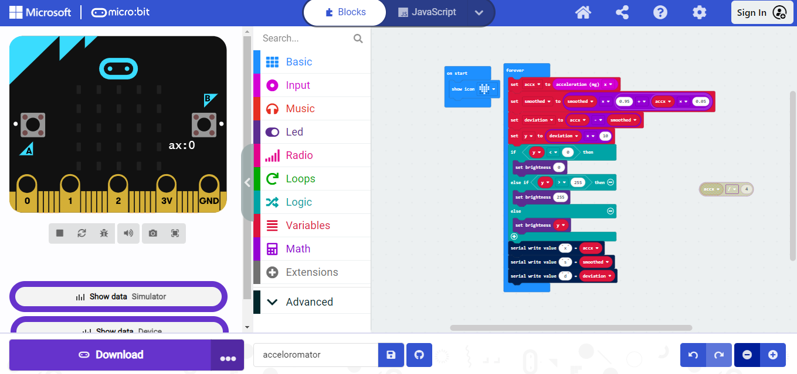

Though once i created this i noticed that when i sat it down and left it on it would feel the vibrations though the floor and start to flicker when it sensed movement. This video shows how it flashing while i walk in place. 
<video width="320" height="240" controls>
  <source src="./Images/Motion.mp4" type="video/mp4">
  Your browser does not support the video tag.
</video>

I have found this particularly useful while im at my desk with headphones on i can tell when someone is opening the door or walking through the house. (it even works for the big dog) It stops my roommates from sneaking up behind me and scaring me.

I just found this intersting and kind of enjoy the interaction and how seemless it is. Im not sure if i can work further with this but i though it was worth mentioning.

# Week 2
**14/9/24**

In week 2 i began exploring more options for my device such as wearable devices and data responsive art. 

**albedo of clouds:**
The data responsive art made me think back to the albedo of clouds experiment that we read about earlier in the course in the book by Randerson et al 2015 (https://learn.usc.edu.au/courses/27670/files/1795139?wrap=1#) where government astronomers from australia "Robert Ellery and P. Baracchi" attempted to photograph the same cloud at the same time from two different locations. The melbourne observatory and the roof of victorias parliment house.
 
This made me think i could create something that is data driven and relates to cloud albedo levels in specific areas.

maybe i could try recreate the 1950s experiment of trying to photograph the same cloud from different perspectives at the same time and create a platform for posting and collaborating.

**wearable techonology:**
Looking at the devices shared in the modules such as the celestial sensing jumpsuit (https://www.theverge.com/2018/4/14/17233430/wearable-media-fashion-tech-nyc-ceres-jumpsuit-interactive) and learning about the light up back-pack straps that respond to sound to warn deaf people of potential hazards made me think of potential wearable devices i could create.
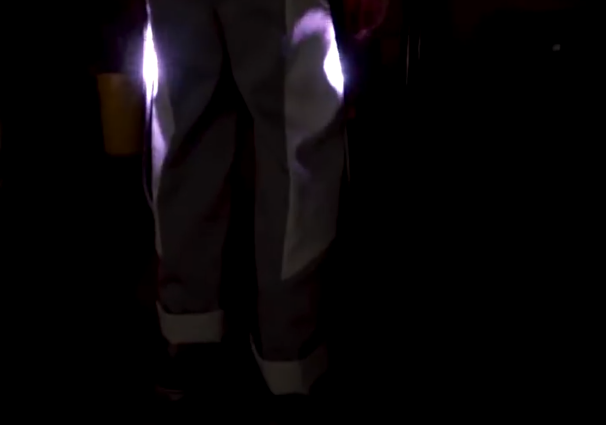

I could create something that it worn on the wrist in a game of basketball using the micro bit that can use the acceloromotor to retrieve the angles of someones arm so they can compare how their movement might change during practise. 

A device for pets to be worn around the collar that when the device reaches a certain decible level a sound will play to discourage them. This could useful to prevent loud animals becoming disruptive. 

# Week 3
**21/9/24**

Working through the modules i added the device orientation and media capture apis to the weather api web page that we created earlier in the course.

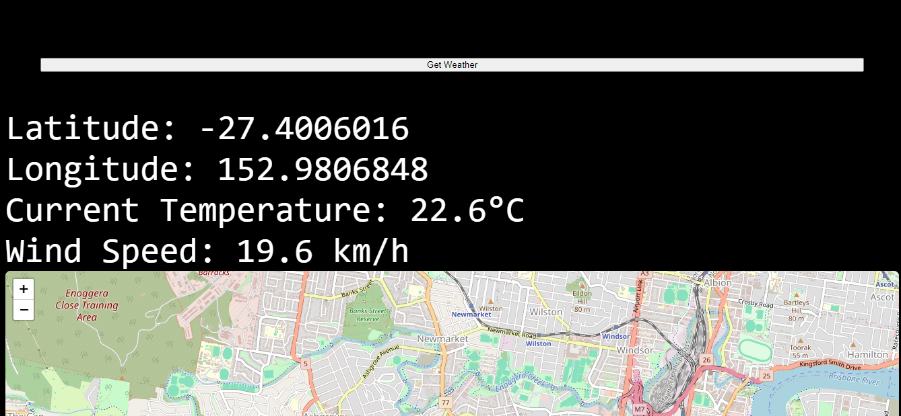
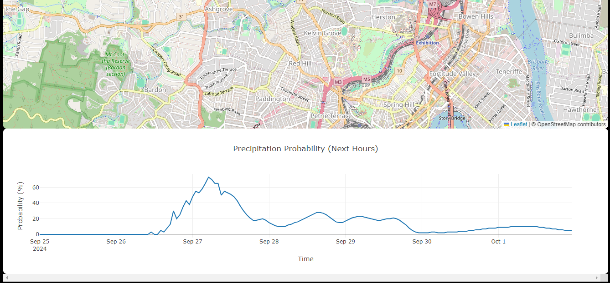
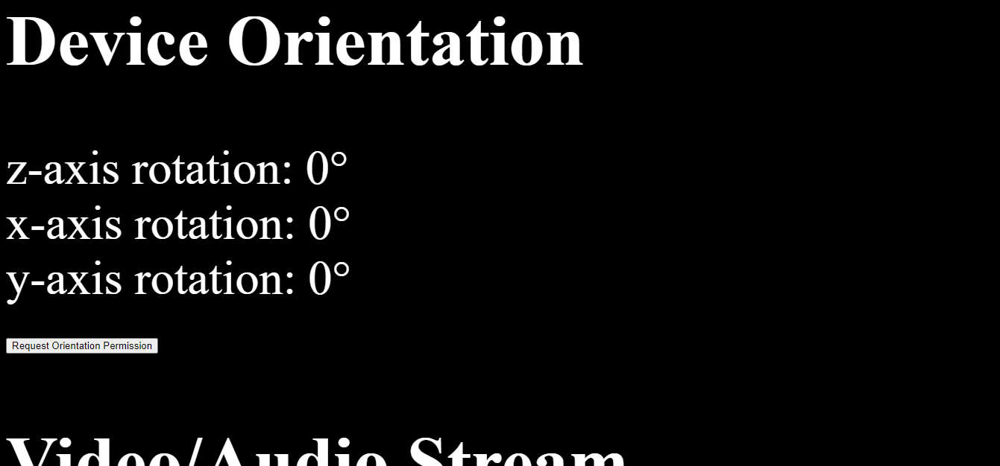
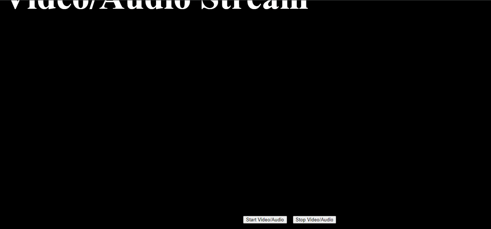

I figured it would be a good idea to have all the information in one location for easier access in the future and could be something i keep coming back to in the future to work off of. 

# Week 4
**28/9/24**

Reading deeper into human computer interaction specifically has made me think more about making my device be something that seemlessly integrates with life as opposed to something that creates an alert to grab the users attention. Using the environtment around users to create an interaction that makes sense and feels natural seems to be the ultimate goal of this project. and so far my ideas are based more around retriving information and displaying it in someway. I think the most natural idea i have has so far would be the wrist band to retrieve postioning and angles of a basketball players wrist during jumpshots. This uses cognitive processes to display information that is not easily accessible that can be then be used to inform future decisions in the user reaches conclusion they might not have reached without the device. 

**29/9/24**

Revisiting earlier material ive been thinking about doing a wearable device similar to the light up backpack. Maybe using the pedomotor to track steps and illuminate led in some shoelaces or building off this i could use the motion sensor on the microbit to sense when a basketball passes through a hoop and illuminates the net. this interaction seems approriate since its seemless and doesnt require any physical interaction.

Ive bought a led strip to that can be controlled with the micro bit i hope to use that in my final project

# Week 5 
**1/10/24**

turns out the led strips were not compatible with the micro bit 

i decided to use the onboard accelerometor to be used as a device used for practise in sport. 

what ive been working on so far has been a device that counts your dribbles while playing a game of basketball 

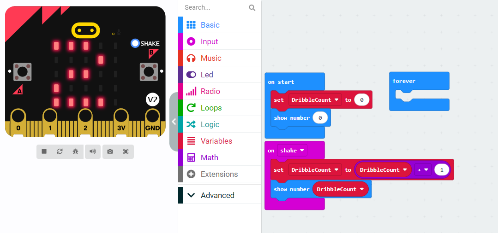

This method would involve holding the microbit on the users wrist while they practise a drill 

# Similar devices

**2/10/24** 

Similar devices can be found in the shot tracker. This device uses an array of sensors on the court and players to track the postition and movement of the players and ball. 
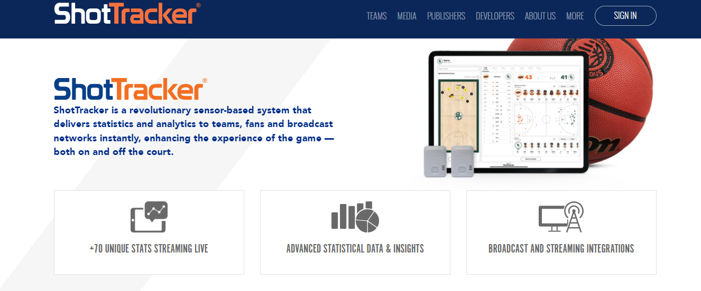

teams of tomorrow use a wrist sensor and a net sensor to track your attempts and misses. The accompanying smartphone app captures and displays your data, including your time on the court, the number of points you scored and your performance in each part of the court. The court zone map tells you where you need to brush up and where your best shot remains.

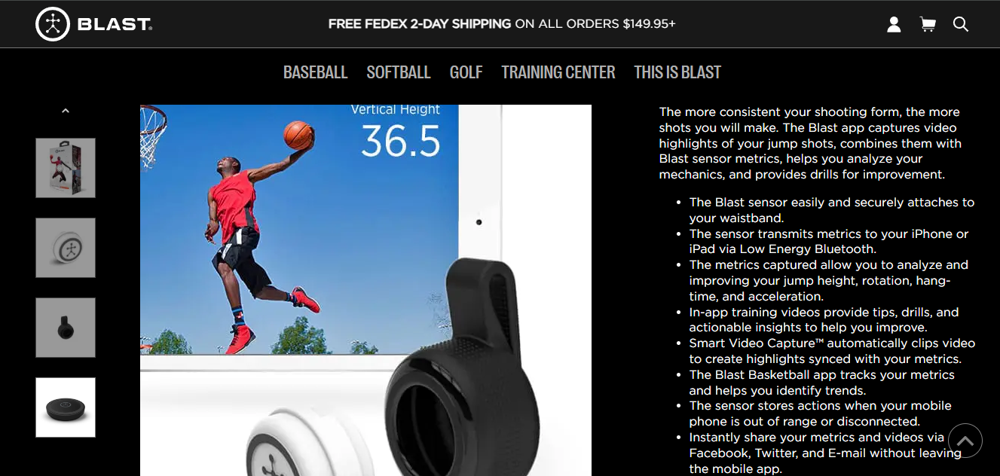

The blastbasketball replay is said to be a waist worn device that tracks the users vertile leap angles of spin moves and length of hangtime 

**3/10/24**

i have been working on the code for the wrist worn device. This uses the acceleromotor to display the x axis. Ive added some smoothing to make the data easier to read. I feel like this could be useful to build of off and add more features. potentially some mobile connectivity, user feedback and mini games built in. 

my biggest struggle so far is finding a way to display the information in a meaningful and exciting way. 
 
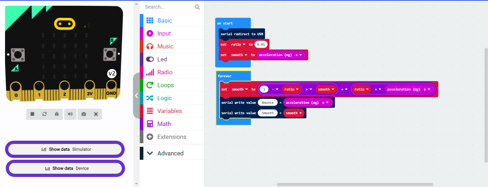

**4/10/24**

I think the bounce code i created earlier will be the focus for my assignment 3 i think the appications and ease of access make this a really viable option 
<video width="320" height="240" controls>
  <source src="./Images/bounce.mp4" type="video/mp4">
  Your browser does not support the video tag.
</video>